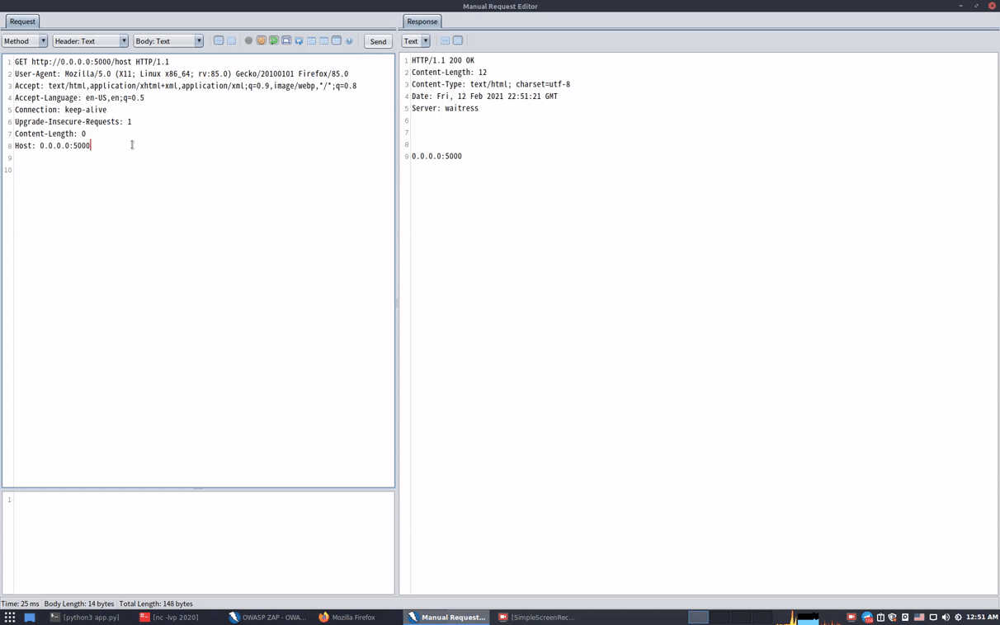

# zaphoster
Fix host header error in zaproxy


add ZAP/zap-hoster.py script to httpsender tab and run app.py

```
$ sudo pip3 install flask requests
$ python3 app.py
```

```
GET https://knassar702.github.io/ HTTP/1.1
Host: knassar702.github.io
User-agent: Firefox test


For Change host header

---
GET https://knassar702.github.io/
Host: knassar702.github.io
User-agent: Firefox test
ZAP-HOST: localhost


ZAP-HOST will be removed and the host header will be change to his value


GET https://knassar702.github.io/ HTTP/1.1
Host: localhost
User-agent: Firefox test
----
follow redirects with  ZAP-REDIRECT header
GET https://knassar702.github.io/
Host: knassar702.github.io
User-agent: Firefox test
ZAP-HOST: localhost
ZAP-REDIRECT: anything


```
### [youtube](https://www.youtube.com/watch?v=1fgNkFwmcbE)


